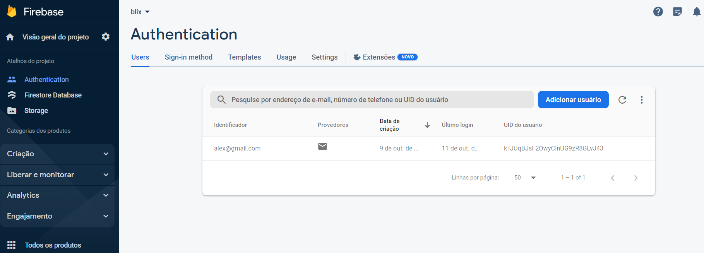
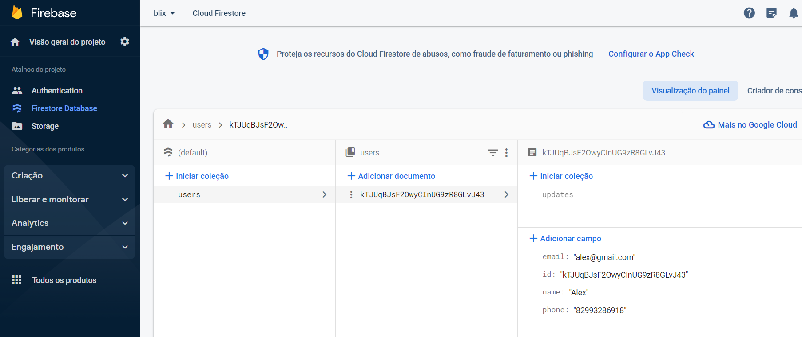
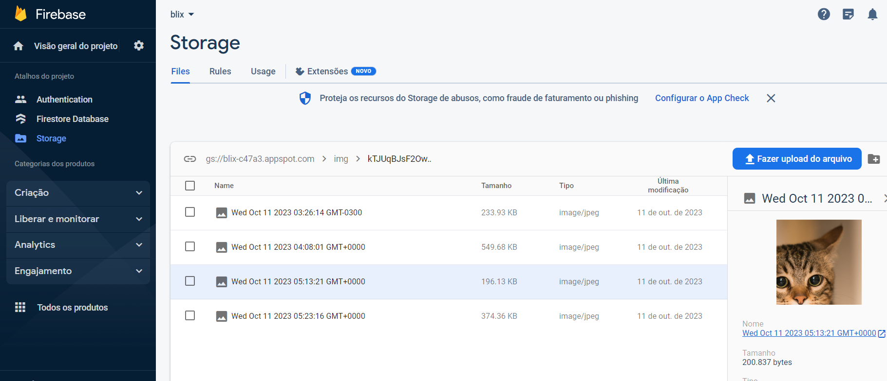

<h1 align="center">Teste Blix</h1>

<h1 align="center">

</h1>


### Download APK:

- [Download](https://firebasestorage.googleapis.com/v0/b/blix-c47a3.appspot.com/o/Blix.apk?alt=media&token=d11c2deb-e967-497d-9f08-25334303fe1a&_gl=1*q92kan*_ga*MTc1ODY4Mjk1NC4xNjg4NTY5Mjk2*_ga_CW55HF8NVT*MTY5NzAwNzUzNi4yOS4xLjE2OTcwMDgxNDUuOS4wLjA.)


### Tecnologias

- [React Native](https://reactnative.dev//)
- [Yarn Workspaces](https://classic.yarnpkg.com/en/docs/workspaces/)
- [Styled-Component](https://styled-components.com/)
- [Firebase](https://firebase.google.com/?hl=pt)
- [Yup](https://github.com/jquense/yup)
- [Formik](https://formik.org/)


### Como usar

```bash
# Clone o repositório
$ git clone git@github.com:alexjou/blix.git

# Entre na pasta
$ cd blix

# Instale as dependencias
$ yarn install ou npm install

# Inicie o site
$ yarn start ou npm start
```

###


## DESCRIÇÃO DO TESTE


## 🏗 O que fazer?

- Nesse desafio, você deverá desenvolver uma aplicação mobile com as seguintes tarefas
* Você deve desenvolver uma aplicação e interface para o seguinte cenário.
* Construir um projeto na firebase;
* Criar um projeto Expo e React Native que possa rodar em emuladores e/ou Expo Go;
* Criar uma tela de cadastro com as seguintes informações: Nome, email, celular e senha
* Criar uma tela de login
* Criar uma tela de perfil para que o usuário possa colocar informações e visualizar o seu progresso,
* sendo as seguintes informações para o usuário editar e visualizar:
* Peso: mostrar gráfico peso x data, conforme os inputs do usuário
* Fotos: usuário poderá dar upload de fotos para que tenha um acompanhamento temporal da
* sua evolução física
* Selecionar o objetivo - (emagrecer, ganhar massa, definir o corpo, bem-estar)


## 🚨 Requisitos

* Firebase;
* Expo;
* React Native;
* Login com Firebase Authentication;
* Informações e cadastro do usuário utilizando o Firestore Database;

+ Adicionado Storage para salvar as imagens

## Utilização do Firebase

- Authentication com e-mail e senha:
<h1 align="center">

</h1>

- Banco de dados Firestorage
<h1 align="center">

</h1>

- Storage para armazenamento de arquivos
<h1 align="center">

</h1>
